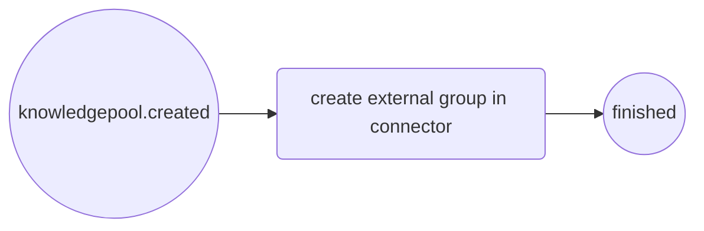
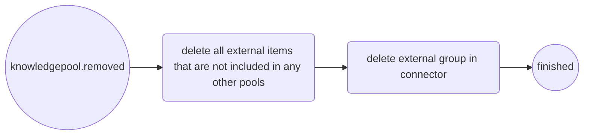
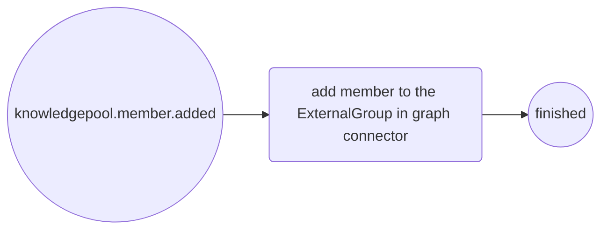
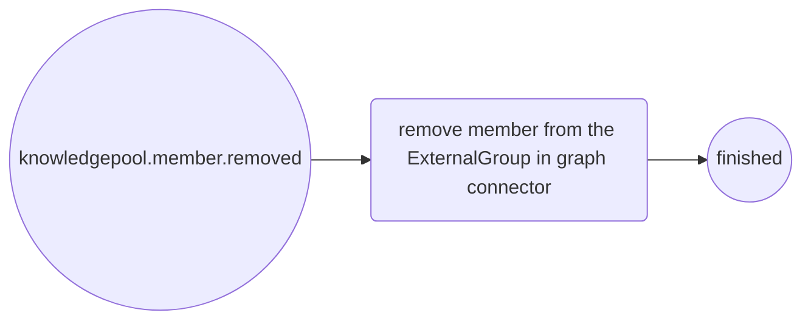
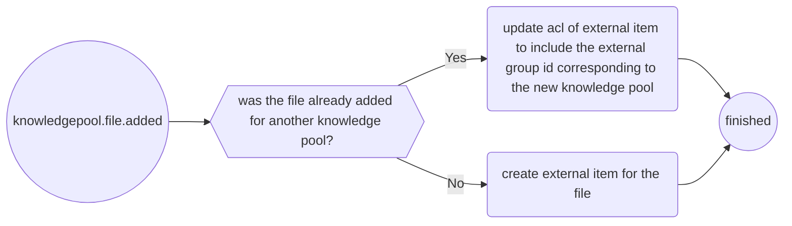
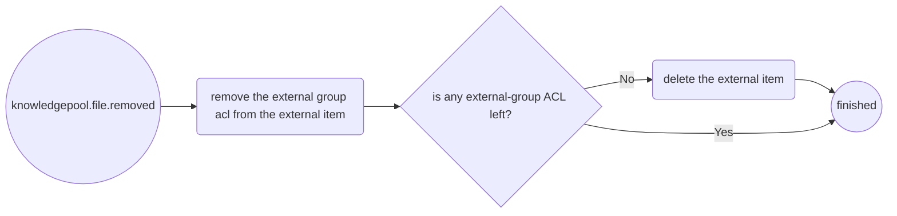
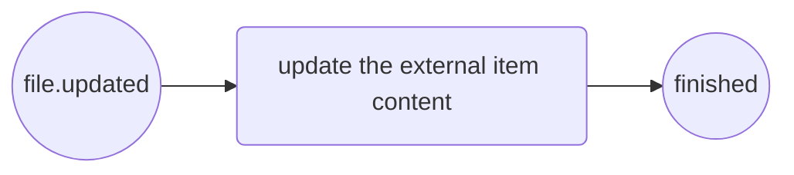

Example payloads

- knowledgepool.created

  {
    "type": "knowledgepool.created",
    "knowledgePoolId": "<knowledgePoolId>"
  }

- knowledgepool.removed

  {
    "type": "knowledgepool.removed",
    "knowledgePoolId": "<knowledgePoolId>"
  }

- knowledgepool.member.added

  {
    "type": "knowledgepool.member.added",
    "knowledgePoolId": "<knowledgePoolId>",
    "roxtraGroupGid": "<roxtraGroupGuid>",
    "externalGroupId": "<externalGroupId>"
  }

- knowledgepool.member.removed

  {
    "type": "knowledgepool.member.removed",
    "knowledgePoolId": "<knowledgePoolId>",
    "roxtraGroupGid": "<roxtraGroupGuid>",
    "externalGroupId": "<externalGroupId>"
  }

- knowledgepool.file.added

  {
    "type": "knowledgepool.file.added",
    "fileId": "<roxFileId>",
    "knowledgePoolId": "<knowledgePoolId>",
    "downloadUrl": "<downloadUrl>",
    "title": "<title>",
    "supportedForKnowledgePools": true
  }

- file.updated

  {
    "type": "file.updated",
    "fileId": "<roxFileId>",
    "downloadUrl": "<downloadUrl>",
    "title": "<title>",
    "supportedForKnowledgePools": true
  }

- knowledgepool.file.removed

  {
    "type": "knowledgepool.file.removed",
    "fileId": "<roxFileId>",
    "knowledgePoolId": "<knowledgePoolId>"
  }
