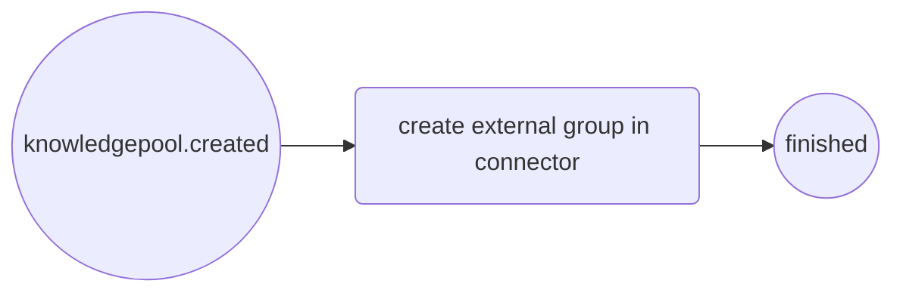
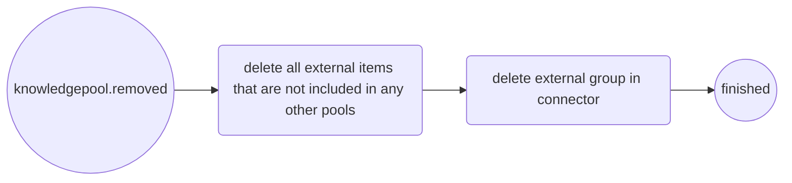
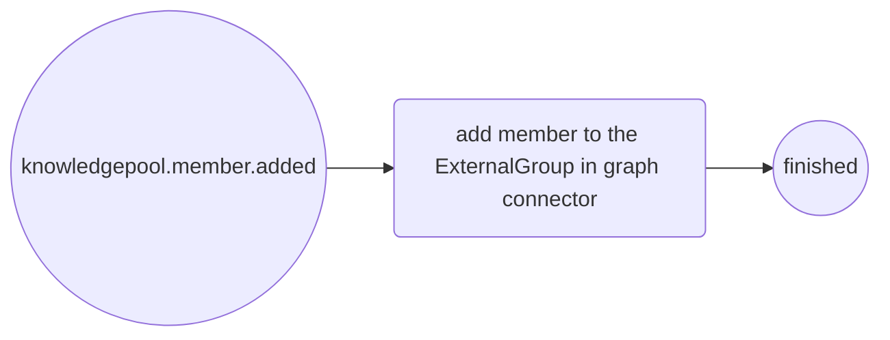
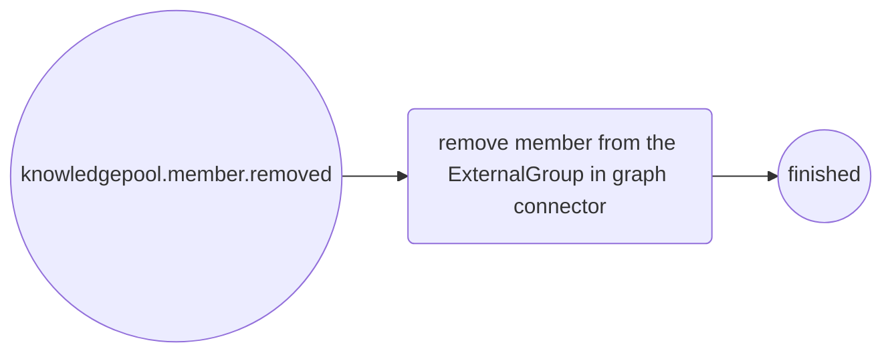
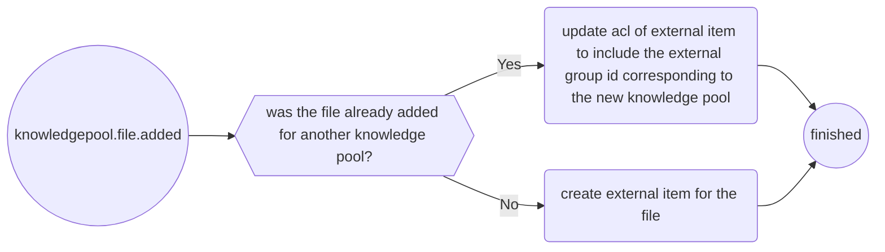
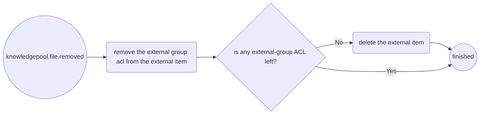
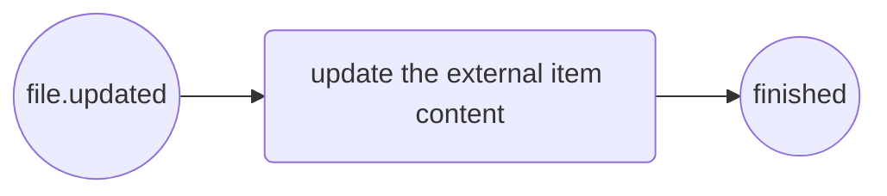

# Webhook Events

The following webhook events reflect roXtra AI Hub with roXtra version 9.137.0. roXtra AI Hub should be configured with the complete webhook URL if a custom route is required. If no explicit route is provided, the default path `POST /api/v1/webhooks/events/receive` is used.  
roXtra AI Hub can also include additional custom headers and query parameters on webhook calls. The payload examples below focus on the JSON body only.  
Events related to documents are only sent if the document is released and is either a PDF or contains a PDF attachment. Other document types are ignored.


```mermaid
flowchart LR
    event((knowledgepool.created)) --> createExternalGroup(create external group in connector)
    createExternalGroup --> finished((finished))
```


```mermaid
flowchart LR
    event((knowledgepool.removed)) --> checkAllExternalItems(delete all external items that are not included in any other pools)
    checkAllExternalItems --> deleteExternalGroup(delete external group in connector)
    deleteExternalGroup --> finished((finished))
```


```mermaid
flowchart LR
    event((knowledgepool.member.added)) --> addExternalGroupMember(add member to the ExternalGroup in graph connector)
    addExternalGroupMember --> finished((finished))
```


```mermaid
flowchart LR
    event((knowledgepool.member.removed)) --> removeExternalGroupMember(remove member from the ExternalGroup in graph connector)
    removeExternalGroupMember --> finished((finished))
```


```mermaid
flowchart LR
    event((knowledgepool.file.added)) --> checkOtherKnowledgepool{{was the file already added for another knowledge pool?}}
    checkOtherKnowledgepool --> |Yes| updateAcl(update acl of external item to include the external group id corresponding to the new knowledge pool) --> finished
    checkOtherKnowledgepool --> |No| uploadExternalItem(create external item for the file) --> finished((finished))
```


```mermaid
flowchart LR
    event((knowledgepool.file.removed)) --> removeAcl(remove the external group acl from the external item)
    removeAcl --> anyLeft{is any external-group ACL left?}
    anyLeft --> |No| deleteItem(delete the external item) --> finished((finished))
    anyLeft --> |Yes| finished((finished))
```


```mermaid
flowchart LR
    event((file.updated)) --> updateExternalItem(update the external item content)
    updateExternalItem --> finished((finished))
```

Example payloads

- knowledgepool.created

  ```json
  {
    "type": "knowledgepool.created",
    "knowledgePoolId": "<knowledgePoolId>"
  }
  ```

- knowledgepool.removed

  ```json
  {
    "type": "knowledgepool.removed",
    "knowledgePoolId": "<knowledgePoolId>"
  }
  ```

- knowledgepool.member.added

  ```json
  {
    "type": "knowledgepool.member.added",
    "knowledgePoolId": "<knowledgePoolId>",
    "roxtraGroupGid": "<roxtraGroupGuid>",
    "externalGroupId": "<externalGroupId>"
  }
  ```

- knowledgepool.member.removed

  ```json
  {
    "type": "knowledgepool.member.removed",
    "knowledgePoolId": "<knowledgePoolId>",
    "roxtraGroupGid": "<roxtraGroupGuid>",
    "externalGroupId": "<externalGroupId>"
  }
  ```

- knowledgepool.file.added
  - for roXtra version `9.138.0` and later, `downloadUrls` is included in the payload, which contains multiple download URLs for different file formats. `downloadUrl` is still included for backward compatibility. `supportedForKnowledgePools` now represents whether the file is available as PDF for backward compatibility.

  ```json
  {
    "type": "knowledgepool.file.added",
    "fileId": "<roxFileId>",
    "knowledgePoolId": "<knowledgePoolId>",
    "downloadUrl": "<downloadUrlForPdf>",
    "downloadUrls": {
      "pdf": "<downloadUrlForPdf>",
      "docx": "<downloadUrlForOriginalFile>"
    },
    "title": "<title>",
    "documentHash": "<documentHash>",
    "supportedForKnowledgePools": true
  }
  ```

  - for roXtra version `9.137.0`, `documentHash` is included in the payload

  ```json
  {
    "type": "knowledgepool.file.added",
    "fileId": "<roxFileId>",
    "knowledgePoolId": "<knowledgePoolId>",
    "downloadUrl": "<downloadUrlForPdf>",
    "title": "<title>",
    "documentHash": "<documentHash>",
    "supportedForKnowledgePools": true
  }
  ```

  - for roXtra version lower than `9.137.0`

  ```json
  {
    "type": "knowledgepool.file.added",
    "fileId": "<roxFileId>",
    "knowledgePoolId": "<knowledgePoolId>",
    "downloadUrl": "<downloadUrlForPdf>",
    "title": "<title>",
    "supportedForKnowledgePools": true
  }
  ```

- file.updated
  - for roXtra version `9.138.0` and later, `downloadUrls` is included in the payload, which contains multiple download URLs for different file formats. `downloadUrl` is still included for backward compatibility. `supportedForKnowledgePools` now represents whether the file is available as PDF for backward compatibility.

  ```json
  {
    "type": "file.updated",
    "fileId": "<roxFileId>",
    "knowledgePoolId": "<knowledgePoolId>",
    "downloadUrl": "<downloadUrlForPdf>",
    "downloadUrls": {
      "pdf": "<downloadUrlForPdf>",
      "docx": "<downloadUrlForOriginalFile>"
    },
    "title": "<title>",
    "documentHash": "<documentHash>",
    "supportedForKnowledgePools": true
  }
  ```

  - for roXtra version `9.137.0`, `documentHash` is included in the payload

  ```json
  {
    "type": "file.updated",
    "fileId": "<roxFileId>",
    "knowledgePoolId": "<knowledgePoolId>",
    "downloadUrl": "<downloadUrlForPdf>",
    "title": "<title>",
    "documentHash": "<documentHash>",
    "supportedForKnowledgePools": true
  }
  ```

  - for roXtra version lower than `9.137.0`

  ```json
  {
    "type": "file.updated",
    "fileId": "<roxFileId>",
    "knowledgePoolId": "<knowledgePoolId>",
    "downloadUrl": "<downloadUrlForPdf>",
    "title": "<title>",
    "supportedForKnowledgePools": true
  }
  ```

- knowledgepool.file.removed

  ```json
  {
    "type": "knowledgepool.file.removed",
    "fileId": "<roxFileId>",
    "knowledgePoolId": "<knowledgePoolId>"
  }
  ```
