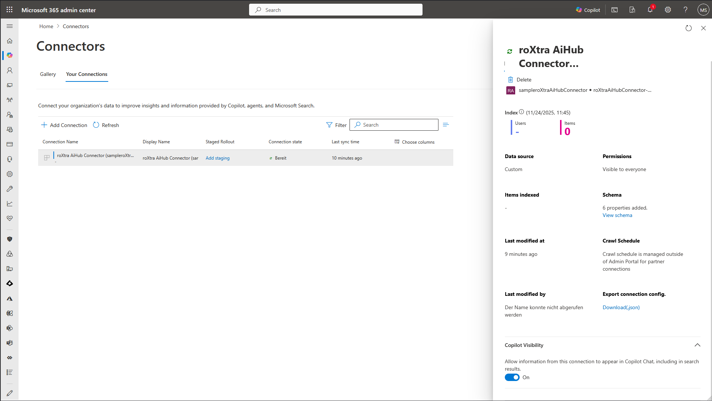
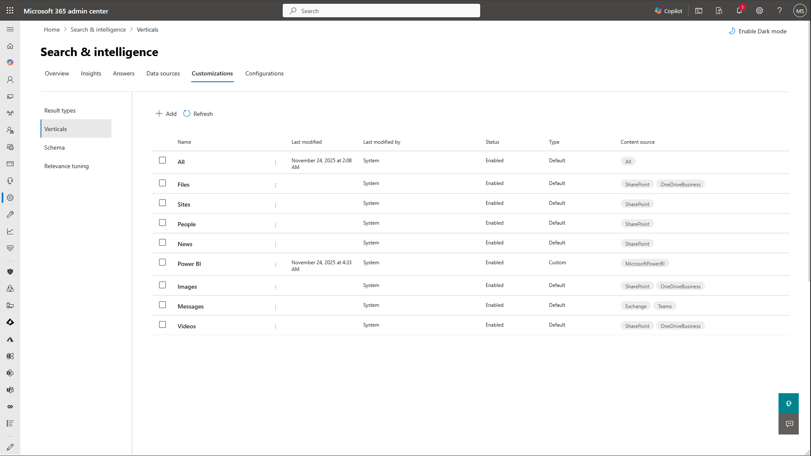
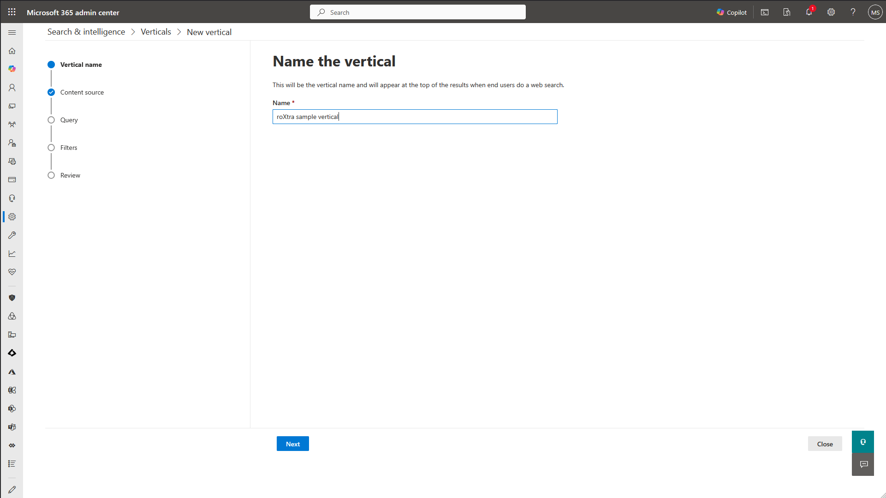
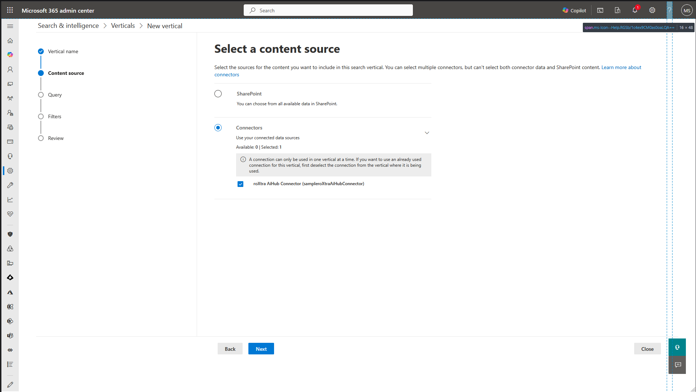
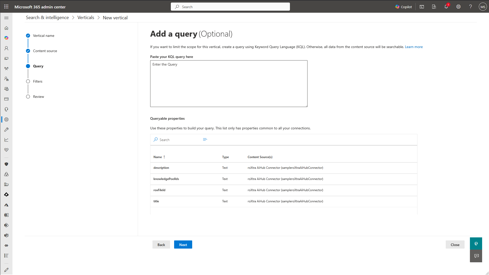
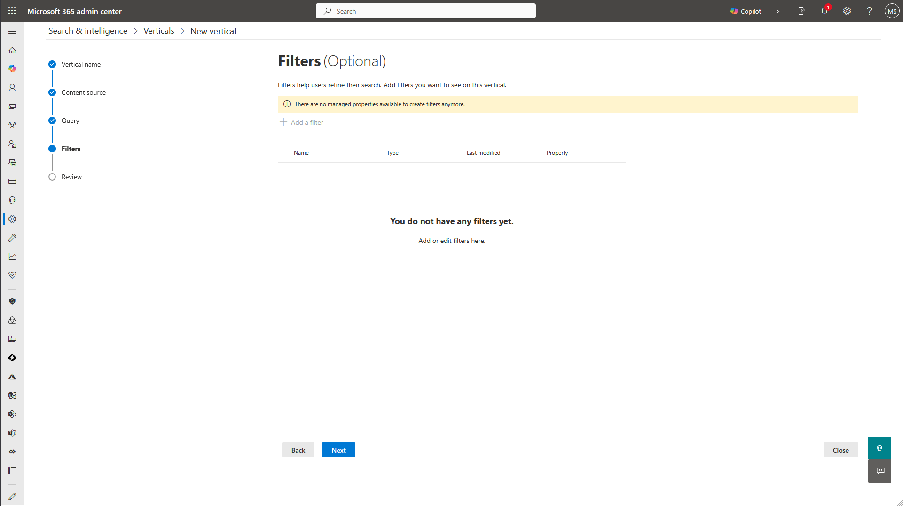
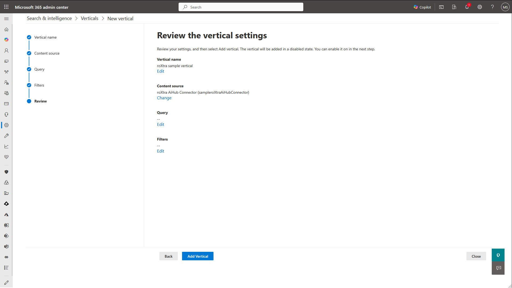
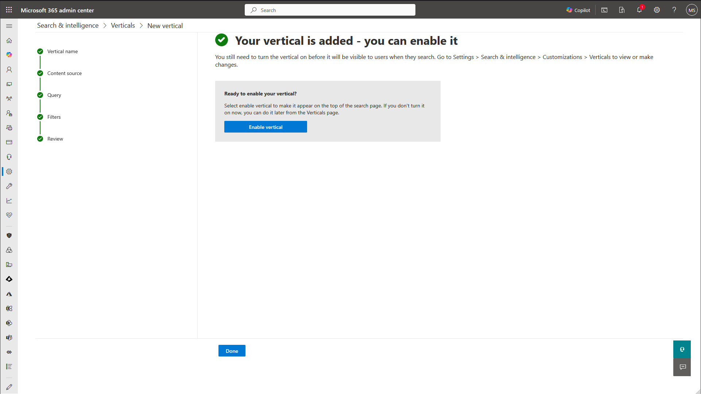

# roXtra AI Hub M365 Connector - Quick Install

## Install
- From the extracted release ZIP folder (run PowerShell as Administrator):
  `pwsh -File .\setup.ps1`
- If the service exists, you'll be prompted to replace it.

## Configure
- Create `appsettings.Production.json` in the install directory (e.g., `C:\Program Files\roXtraAiHubM365Connector`).
- Adjust the following values for your environment:

```
{
  "Webhooks": {
    "ApiKey": "CHANGE_ME"
  },
  "Roxtra": {
    "RoxtraUrl": "https://your-roxtra/roxtra"
  },
  "Graph": {
    "TenantId": "CHANGE_ME",
    "ClientId": "CHANGE_ME",
    "ClientSecret": "CHANGE_ME",
    "ExternalConnectionId": "CHANGE_ME"
  },
  "ConnectionStrings": {
    "Default": "Data Source=connector.db"
  }
}
```

The `Graph` section must match the Azure app that you created.

- Optional: HTTP binding (host/port) — copy the `Kestrel` section from `appsettings.json` into `appsettings.Production.json` and adjust if you need a different host/port, e.g.:

```
"Kestrel": {
  "Endpoints": {
    "Http": { "Url": "http://localhost:5254" }
  }
}
```

- Optional: HTTPS binding — add an `Https` endpoint and configure a certificate (file or store). Example with a PFX file:

```
"Kestrel": {
  "Endpoints": {
    "Https": {
      "Url": "https://localhost:5255",
      "Certificate": {
        "Path": "C\\path\\to\\cert.pfx",
        "Password": "CHANGE_ME"
      }
    }
  }
}
```

## Start
- After saving, start the service: `Start-Service roXtraAiHubM365Connector`.
- Logs are written to `Logs/roXtraAiHubConnector.log` (under the install directory).

## Configure `Search` with the new connector

The external connector will register itself after starting the service. You can verify this in the Microsoft 365 admin center:
- Go to `Copilot` -> `Connectors` -> `Your Connections`  


- Select the `roXtra AiHub Connector` to see details. Make sure that `Connection state` is `Ready`.
- To enable search and Copilot access, go to `Copilot Visibility` and enable the option.



- For the search to work, a `Vertical` must be created. Go to `Search & Intelligence` -> `Verticals` and add a new vertical.



- Start by setting the `Name`.



- Then, select `Connectors` and add the `roXtra AiHub Connector`.



- (Optional) add a `KQL Query` to filter the results if needed.



- (Optional) add `Filters`.



- Review and create the vertical.



- Enable the vertical after creation.




## Connect roXtra AiHub service

The connection between roXtra AiHub and the external connector is configured by the Roxtra GmbH. To have your knowledge pools synced, please contact roXtra support or your roXtra contact person to set up the connection.  

When requesting the connection setup, please provide the following details:

- The connector's webhook URL: `https://<your-host>:<your-port>`

- The `ApiKey` you set in `appsettings.Production.json`
