# roXtra AI Hub M365 Connector - Quick Install

This sample reflects roXtra AI Hub with roXtra version 9.137.0.

Legacy note: if you use the sample connector unchanged, the webhook endpoint remains `POST /api/v1/webhooks/events/receive` as before.

Earlier behavior:

- The sample setup only documented the default webhook path `POST /api/v1/webhooks/events/receive`.
- Customer-specific headers and query parameters from roXtra AI Hub could not be configured and therefore could not be sent for compatibility with customer systems.
- The event payload additions such as `documentHash` were not sent.

## Build From Source

See [BUILD.md](BUILD.md) for the release-aligned build and packaging process.

## Install

- Install [.NET 10 Hosting Bundle](https://builds.dotnet.microsoft.com/dotnet/aspnetcore/Runtime/10.0.2/dotnet-hosting-10.0.2-win.exe)
- Download the [latest](https://github.com/roXtra/aihub-connectors/releases/latest) release ZIP and extract it
- Open PowerShell as Administrator in the extracted folder and run:
  `pwsh -File .\setup.ps1`
- If the service exists, you'll be prompted to replace it.
- The service will be installed in `C:\Program Files\roXtraAiHubM365Connector` by default
- Delete the extracted folder after installation if needed

## Create Azure App

- Go to the [Azure Portal](https://portal.azure.com) and create a new `App Registrations`
- Select `Accounts in this organizational directory only (Single tenant)` and click `Register`
- Go to `Certificates & secrets`
- Create a new `Client secret` and copy the value (you'll need it later)
- Go to `API permissions`
- Add the following permissions:
  - `ExternalItems.ReadWrite.OwnedBy`
  - `ExternalConnections.ReadWrite.OwnedBy`
- Click `Grant admin consent for <your-tenant>` and confirm

## Configure

- Create `appsettings.Production.json` in the install directory (e.g., `C:\Program Files\roXtraAiHubM365Connector`).
- Adjust the following values for your environment:

```
{
  "Webhooks": {
    "ApiKey": "CHANGE_ME"
  },
  "Roxtra": {
    "RoxtraUrl": "https://your-roxtra/roxtra"
  },
  "Graph": {
    "TenantId": "CHANGE_ME",
    "ClientId": "CHANGE_ME",
    "ClientSecret": "CHANGE_ME",
    "ExternalConnectionId": "CHANGE_ME"
  },
  "ConnectionStrings": {
    "Default": "Data Source=connector.db"
  }
}
```

The `Graph` section must match the Azure app that you created.

- `TenantId`: Your Azure AD tenant ID
- `ClientId`: The Application (client) ID of the registered app
- `ClientSecret`: The client secret value you generated
- `ExternalConnectionId`: The ID of the external connection that will be created. Should not contain spaces or special characters (e.g., `roXtraAiHubConnector`)

- Optional: HTTP binding (host/port) — copy the `Kestrel` section from `appsettings.json` into `appsettings.Production.json` and adjust if you need a different host/port, e.g.:

```
"Kestrel": {
  "Endpoints": {
    "Http": { "Url": "http://localhost:5254" }
  }
}
```

- Optional: HTTPS binding — add an `Https` endpoint and configure a certificate (file or store). Example with a PFX file:

```
"Kestrel": {
  "Endpoints": {
    "Https": {
      "Url": "https://localhost:5255",
      "Certificate": {
        "Path": "C\\path\\to\\cert.pfx",
        "Password": "CHANGE_ME"
      }
    }
  }
}
```

## Start

- After saving, start the service: `Start-Service roXtraAiHubM365Connector`.
- Logs are written to `Logs/roXtraAiHubConnector.log` (under the install directory).

## Configure `Search` with the new connector

The external connector will register itself after starting the service. You can verify this in the Microsoft 365 admin center:

- Go to `Copilot` -> `Connectors` -> `Your Connections`

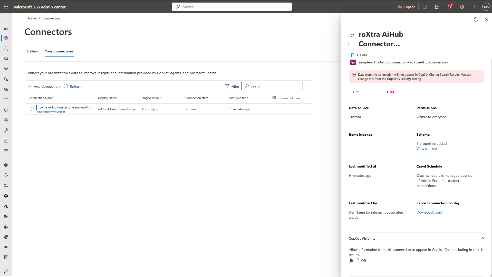

- Select the `roXtra AiHub Connector` to see details. Make sure that `Connection state` is `Ready`.

### Configure Search for M365 Copilot

- To enable search in Copilot, go to `Copilot Visibility` and enable the option.

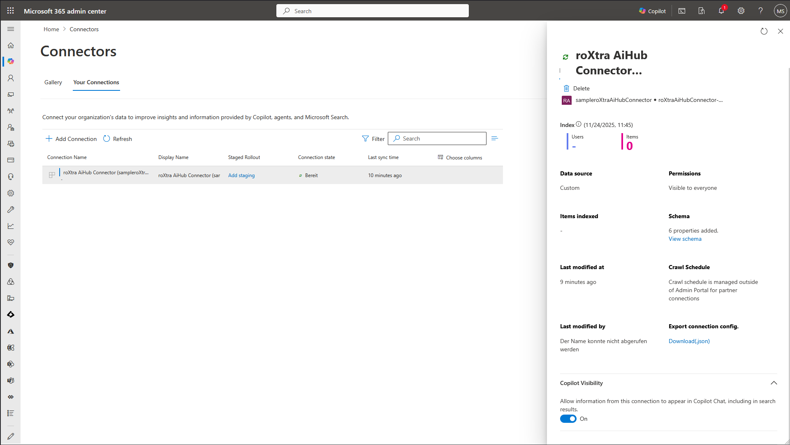

### Configure Search Verticals

- For the common search to work, a `Vertical` must be created. Go to `Search & Intelligence` -> `Verticals` and add a new vertical. This must not be done for M365 Copilot search.

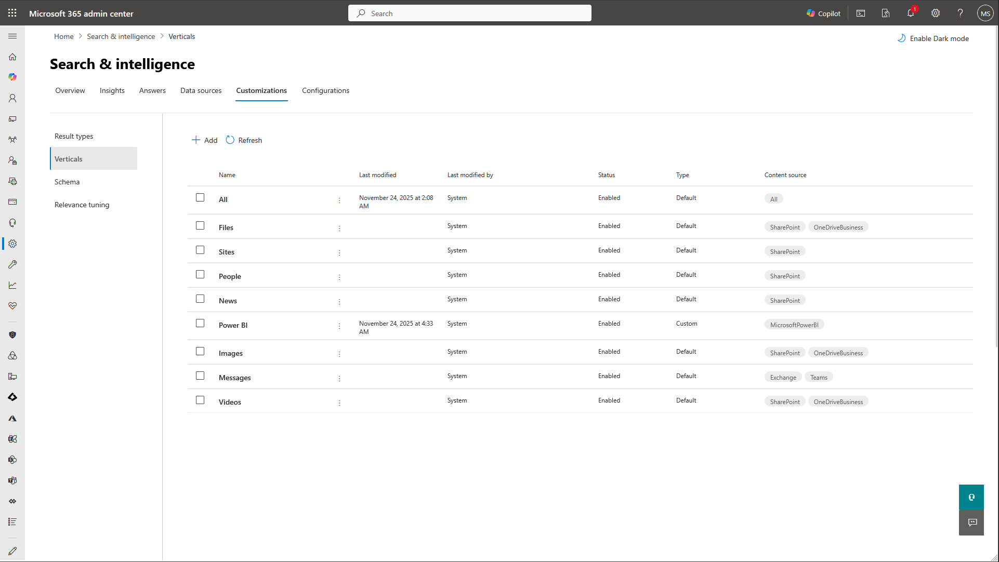

- Start by setting the `Name`.

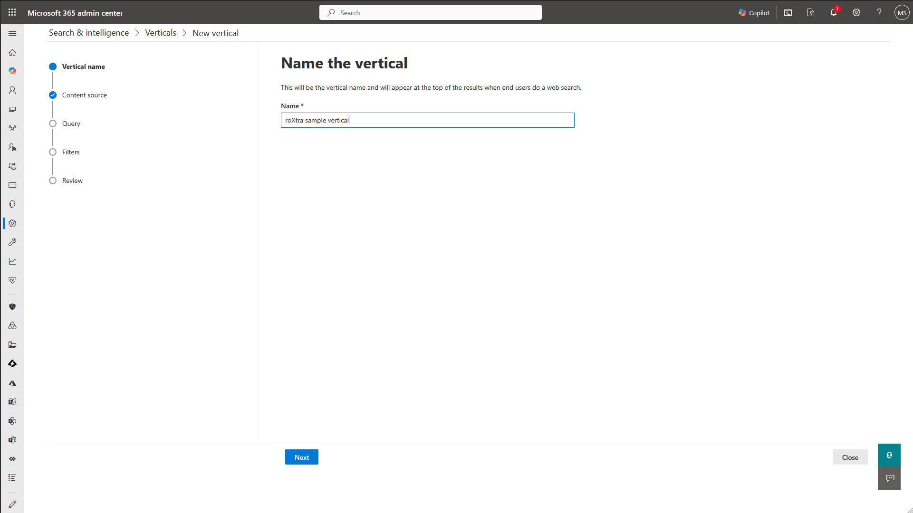

- Then, select `Connectors` and add the `roXtra AiHub Connector`.

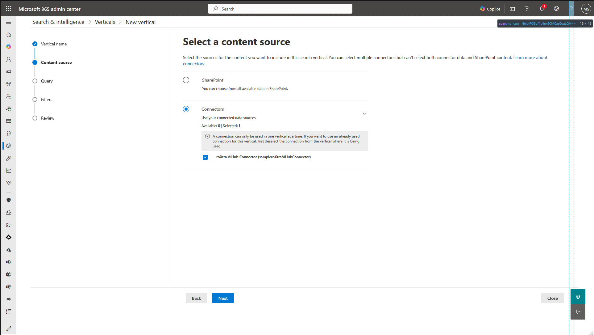

- (Optional) add a `KQL Query` to filter the results if needed.

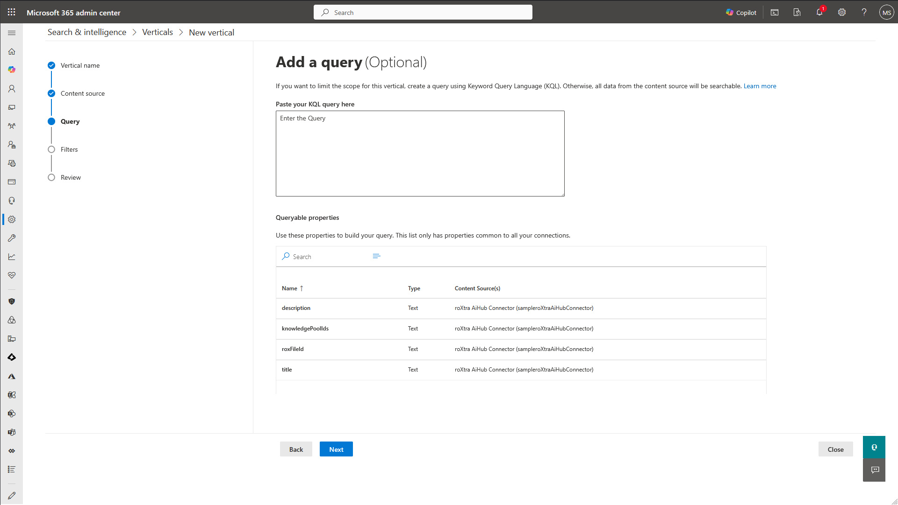

- (Optional) add `Filters`.

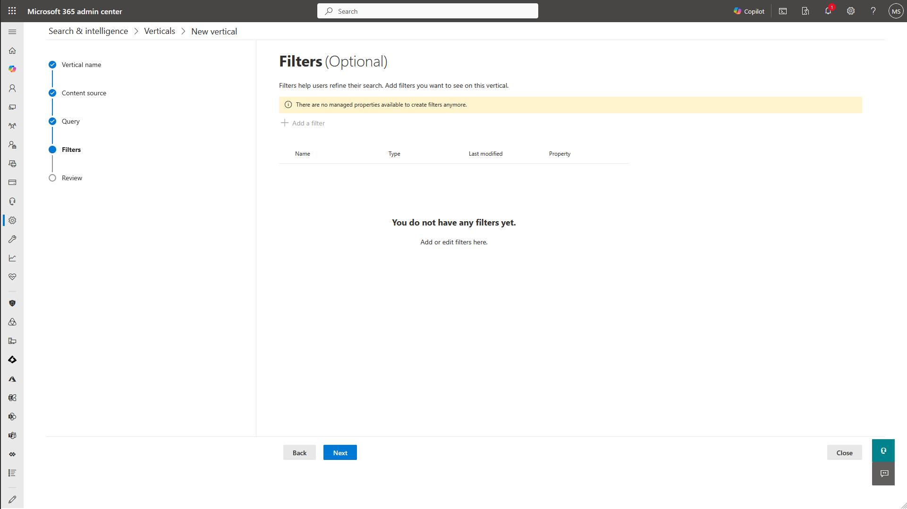

- Review and create the vertical.

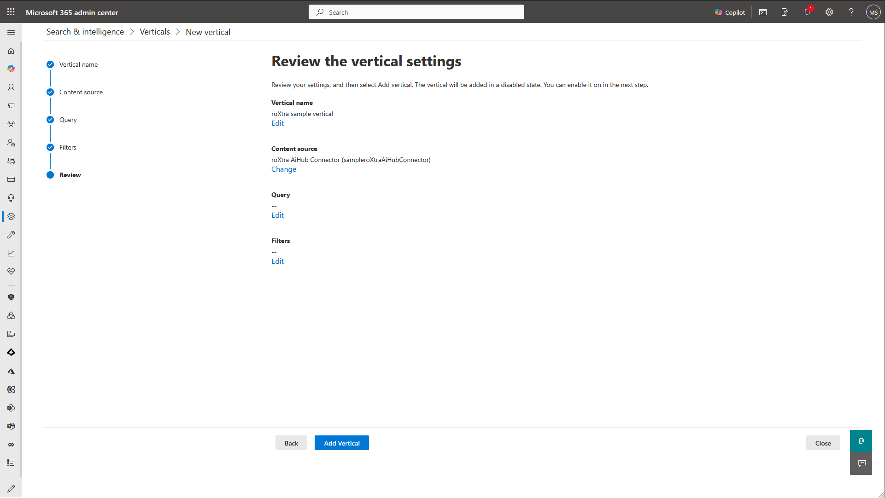

- Enable the vertical after creation.

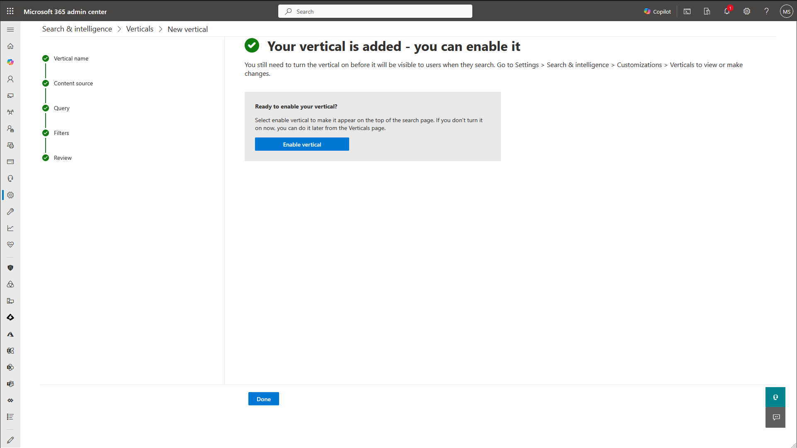

## Create M365 Copilot Agent with roXtra search

Start by creating a new agent in [Microsoft Copilot Studio](https://copilotstudio.microsoft.com/).

- Go to `Agents` and click `Create new agent`. Set details as needed and click `Create`.

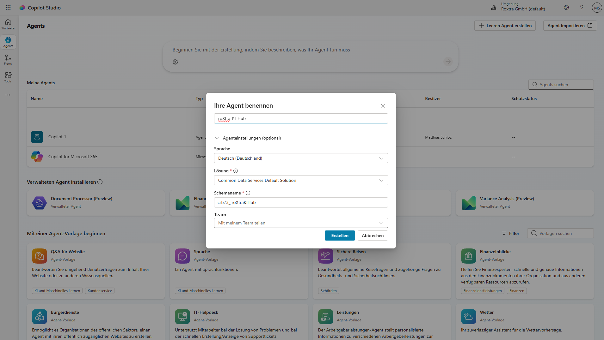

- After creation, go to `Knowledge` and click `Add knowledge`.

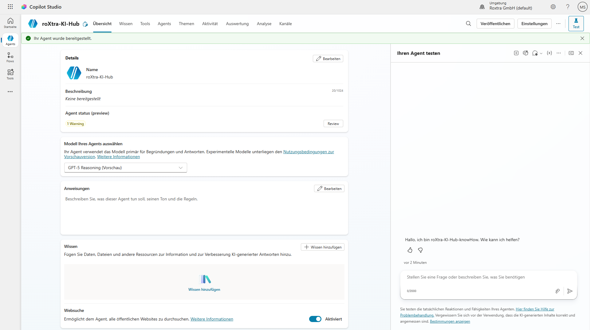

- Switch tab to `More` and select `Custom Connector`.

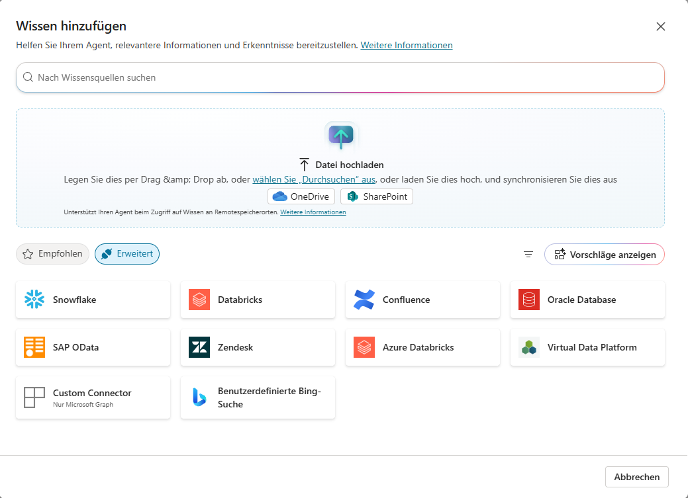

- Select the `roXtra AiHub Connector` and click `Add`. The connector is named after the Azure app's display name, so make sure to set a recognizable name when creating the Azure app. If you dont see the connector, try scrolling the list or check if the service is running and registered correctly.

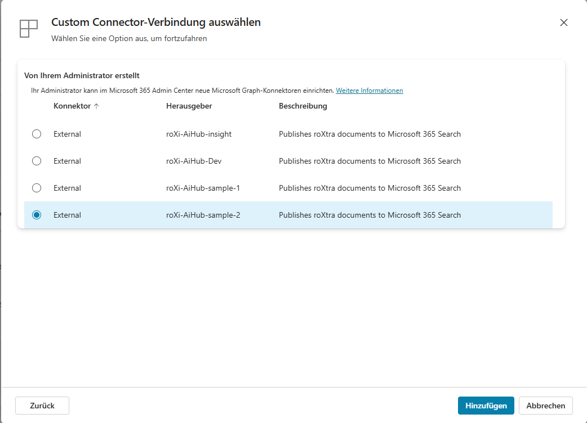

## Connect roXtra AiHub service

The connection between roXtra AiHub and the external connector is configured by the Roxtra GmbH. To have your knowledge pools synced, please contact roXtra support or your roXtra contact person to set up the connection.

When requesting the connection setup, please provide the following details:

- The connector's complete webhook URL if you use a custom route, otherwise the base URL and the default path `/api/v1/webhooks/events/receive` will be used

- Legacy/default setup: `https://<your-host>:<your-port>/api/v1/webhooks/events/receive`

- The `ApiKey` you set in `appsettings.Production.json`
